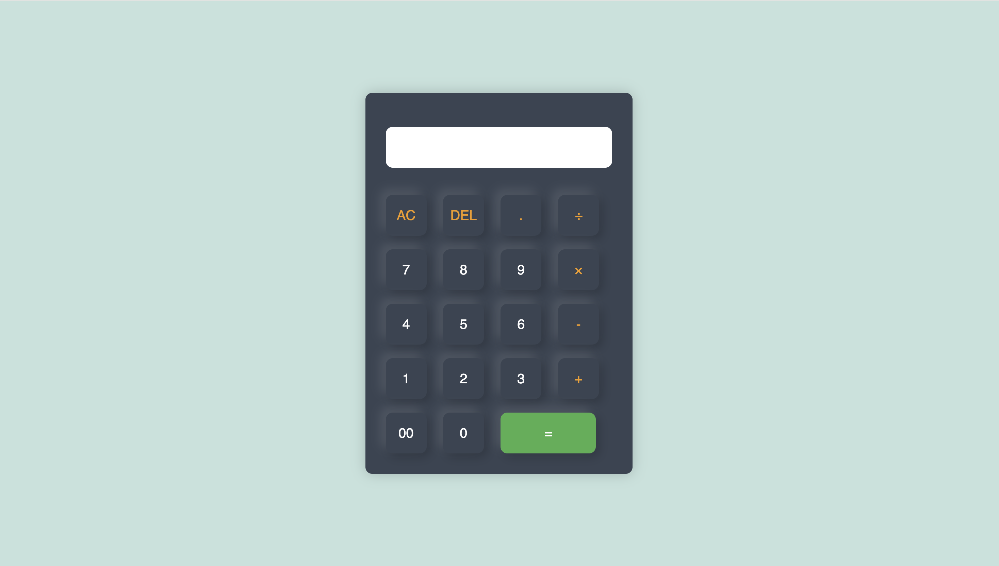

# Simple Calculator

A basic web-based calculator built with **HTML, CSS, and JavaScript**.  
It supports addition, subtraction, multiplication, and division with a clean UI.

## Features
- Perform basic arithmetic operations (`+`, `-`, `×`, `÷`)
- Clear all input (`AC`) or delete last character (`DEL`)
- User-friendly interface with styled buttons
- Responsive design

## How to Use
1. Open `index.html` in your browser.
2. Use the on-screen buttons to enter numbers and operations.
3. Press `=` to calculate the result.
4. Use `AC` to reset or `DEL` to remove the last digit.

## Project Structure

├── index.html   # Main calculator UI
├── style.css    # Styling for calculator
├── script.js    # Calculator logic (button clicks, evaluation)
└── Assets/      # Icons (favicon, optional images)

## Demo
  <!-- (optional, add screenshot if available) -->

---
Made with ❤️ using HTML, CSS & JavaScript.

⸻